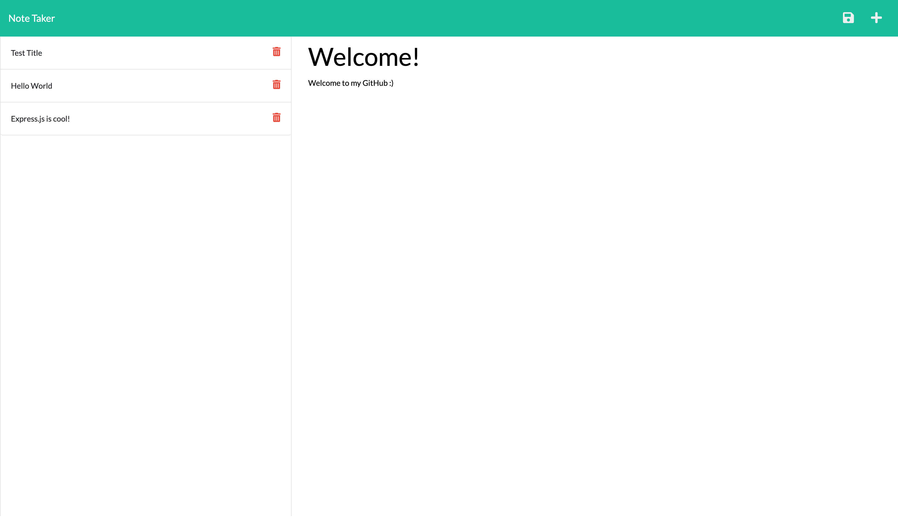

# Note Taker

## Table of Contents
  - [Description](#description)
  - [Learning Points](#learning-points)
  - [Technology Used](#technology-used)
  - [Deployment](#deployment)
  - [Installation](#installation)
  - [Author](#author)
  - [License](#license)

## Description

This project serves as a demonstration of using Express.js to build a note taking app. 

 

## Learning Points

- How to use Express.js.
- How to create api routes for CRUD.
- How to create html routes.
- How to deploy applications using Heroku.

 

## Technology Used

 

 

 

 

 

 

| Technology Used | Resource URL                                                      |
| --------------- | ----------------------------------------------------------------- |
| Express Route Paths | [https://expressjs.com/en/guide/routing.html#route-paths](https://expressjs.com/en/guide/routing.html#route-paths) |
| Express req.body | [https://expressjs.com/en/api.html#req.body](https://expressjs.com/en/api.html#req.body) |
| Using the Fetch API | [https://developer.mozilla.org/en-US/docs/Web/API/Fetch_API/Using_Fetch](https://developer.mozilla.org/en-US/docs/Web/API/Fetch_API/Using_Fetch) |
| Getting Started on Heroku | [https://devcenter.heroku.com/articles/getting-started-with-nodejs?singlepage=true](https://devcenter.heroku.com/articles/getting-started-with-nodejs?singlepage=true) |

 

## Deployment

Website URL: [Note Taker](https://note-taker-lc-f3a7a9f96b3c.herokuapp.com/)

 

## Installation

1. For installation onto local machine, clone provided repository.
2. Use ``npm install`` to install dependencies.
3. Use ``npm run dev`` to initiate the server in your terminal.
4. Visit http://localhost:3000/ in your browser. Default provided port is 3000.

 

## Author

### Lainey Creighton

_Currently a student in the UC Berkeley Full Stack Coding Bootcamp. Contact Below:_

 

 

[dev.lainey@gmail.com](dev.lainey@gmail.com)
 
 

 

[https://www.linkedin.com/in/lainey-creighton/](https://www.linkedin.com/in/lainey-creighton/)
 
 

 

[https://github.com/laineycreighton](https://github.com/laineycreighton)

 

## License

N/A